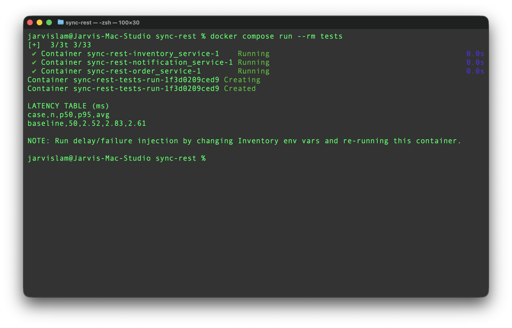
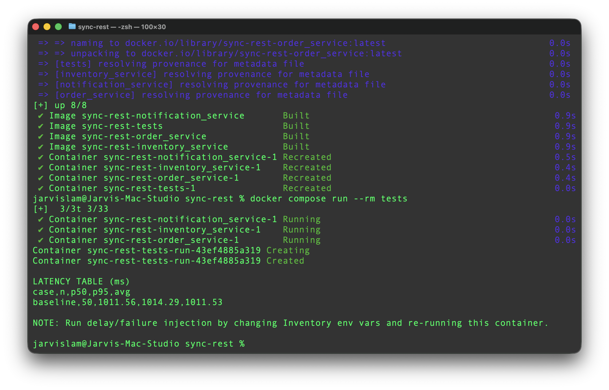
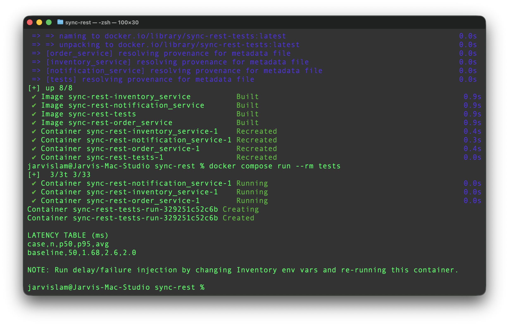
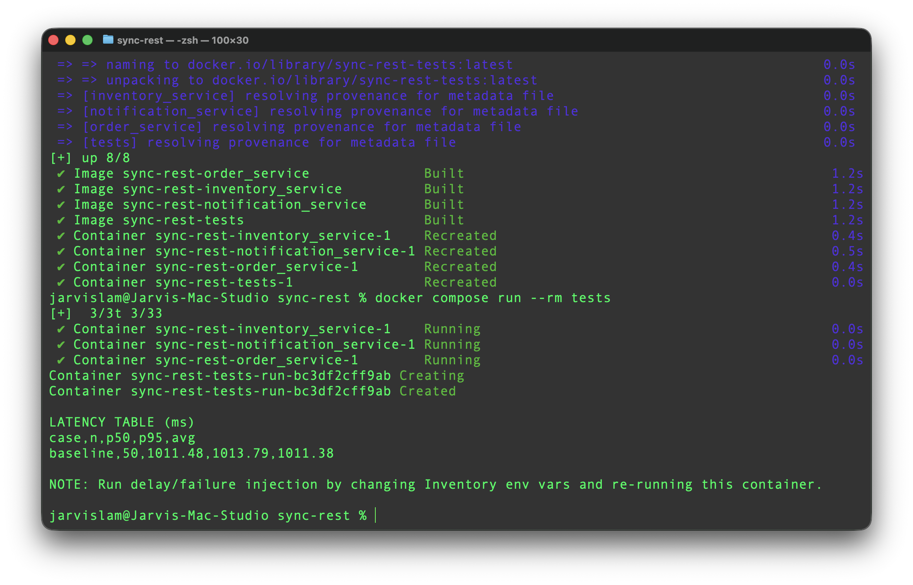
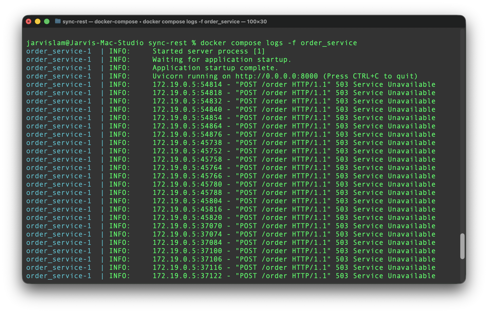
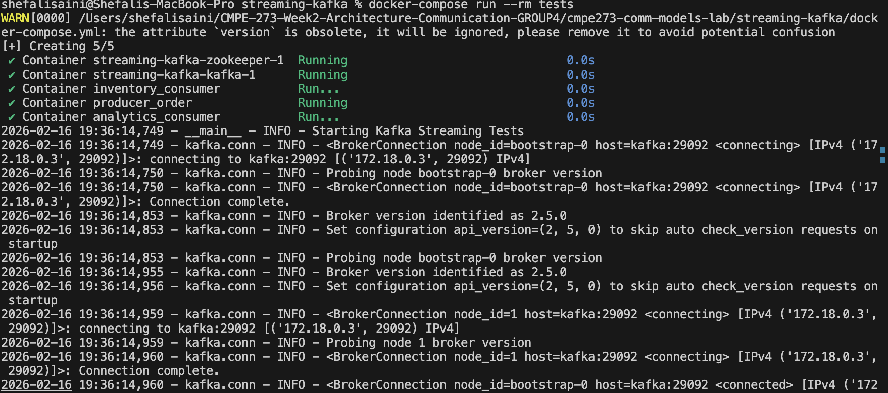
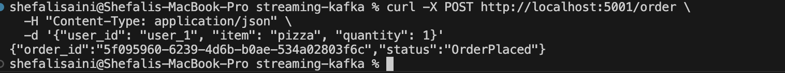
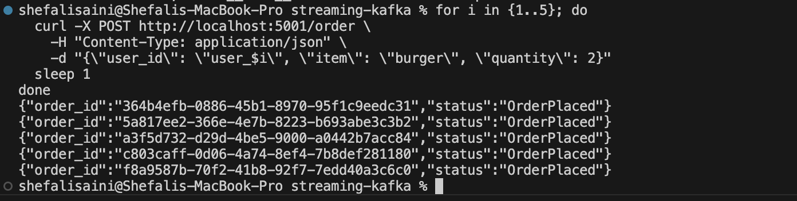
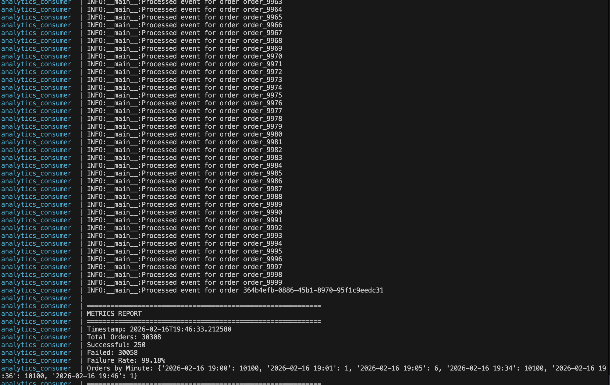

# CMPE 273 Week2 Assignment 
### Group Members: 
Ekant Kapgate, Hei Lam, Shefali Saini and Pranav Jitendra Trivedi

## Part A: Synchronous REST
### 1. Start the system
```bash
cd sync-rest
docker compose up --build -d
docker compose ps
```

### 2. Baseline test (latency table)
```bash
docker compose run --rm tests
```
### 3. Inject 2s delay into Inventory and re-test 
1. Edit sync-rest/docker-compose.yml and set:
```bash
inventory_service:
  environment:
    - DELAY_SEC=2
    - FAIL_MODE=none
  ```
2. Restart inventory (or restart everything):
```bash
docker compose up --build -d
```
3. Run latency test again:
```bash
docker compose run --rm tests
```
### 4. Inject Inventory failure and show OrderService handling (timeout + error)
#### Always fail
1. Edit sync-rest/docker-compose.yml:
```bash
inventory_service:
  environment:
    - DELAY_SEC=0
    - FAIL_MODE=always
```

2. Restart:
```bash
docker compose up --build -d
```
3. Run test:
```bash
docker compose run --rm tests
```
#### Force timeout
1. Keep OrderService timeout at 1s (already set INVENTORY_TIMEOUT_SEC=1.0)
2. Edit sync-rest/docker-compose.yml and Make inventory delay 2s:
```bash
- DELAY_SEC=2
- FAIL_MODE=none
```
3. Restart + test:
```bash
docker compose up --build -d
docker compose run --rm tests
```
### 5. View logs
```bash
docker compose logs -f order_service
# in another terminal if needed:
docker compose logs -f inventory_service
```
### 6. Stop Part A
```bash
docker compose down
```
## Screenshots for part A (Latency table)
Baseline latency test (N requests)

Inject 2s delay into Inventory and measure impact on Order latency

Inject Inventory failure and show how OrderService handles it (timeout + error response)





| Test case                                                       | What you changed                            |    p50 (ms) |    p95 (ms) |    avg (ms) | Observed result                                                 |
| --------------------------------------------------------------- | ------------------------------------------- | ----------: | ----------: | ----------: | --------------------------------------------------------------- |
| Baseline                                                        | Normal services (no injected delay/failure) |    **2.52** |    **2.83** |    **2.61** | 200 responses, very low latency                                 |
| Inventory delay injected (2s) **with OrderService timeout ~1s** | Inventory slowed, OrderService times out    | **1011.56** | **1014.29** | **1011.53** | Many requests return **503 Service Unavailable** (timeout path) |


Why does this behavior happen?
1. Synchronous dependency = critical path latency
   - In Part A, OrderService cannot respond until it finishes calling Inventory (and then Notification). So the Order latency ≈ Inventory latency + Notification latency + overhead.
   - That is the reason why baseline is only a few ms when all services are fast inside Docker.
2. Delay causes latency inflation, but timeout caps it
   - When you injected Inventory slowness (2s), OrderService did not wait the full 2 seconds because it has an upstream timeout (~1 second).
   - Result: latency clusters around ~1011 ms (see the table above), and the response becomes 503.
3. Failure cascades in synchronous systems
   - Any downstream outage/slowdown (Inventory) directly turns into errors at the caller (OrderService). This is a classic “cascading failure” risk in tightly coupled synchronous architectures.


## Part C: Streaming (Kafka or equivalent)
### Test 
1. Start the system
```bash
cd cmpe273-comm-models-lab/streaming-kafka
docker-compose build
docker-compose up -d
```

2. Wait for Kafka to be ready:
```bash
docker-compose logs kafka | grep "started"
```

3. Create a test order via curl:
```bash
curl -X POST http://localhost:5001/order \
  -H "Content-Type: application/json" \
  -d '{"user_id": "user_1", "item": "pizza", "quantity": 1}'
```


This will:

- Producer (port 5001): Publishes OrderPlaced event to Kafka
- Inventory Consumer: Receives the event, processes it, publishes InventoryReserved or InventoryFailed
- Analytics Consumer: Receives inventory events and computes metrics

4. Monitor Events in Real-Time
```bash
docker compose logs -f analytics_consumer
```

5. Run Full Test Suite
```bash
docker-compose run --rm tests
```
This runs 4 tests:

- Baseline Latency: Produces 100 orders, measures end-to-end latency
- 10K Events: Stress test with 10,000 events, measures throughput
- Consumer Lag: Measures lag in the queue
- Replay: Tests offset reset capability

6. Test multiple orders
```bash
for i in {1..5}; do
  curl -X POST http://localhost:5001/order \
    -H "Content-Type: application/json" \
    -d "{\"user_id\": \"user_$i\", \"item\": \"burger\", \"quantity\": 2}"
  sleep 1
done
```

7. Different items
```bash
curl -X POST http://localhost:5001/order \
  -H "Content-Type: application/json" \
  -d '{"user_id": "user_test", "item": "salad", "quantity": 3}'
```

## Screenshots

Run Full Test Suite



Create a test order via curl 



Multiple Orders



Analytics metrics (updated every 30 seconds)




